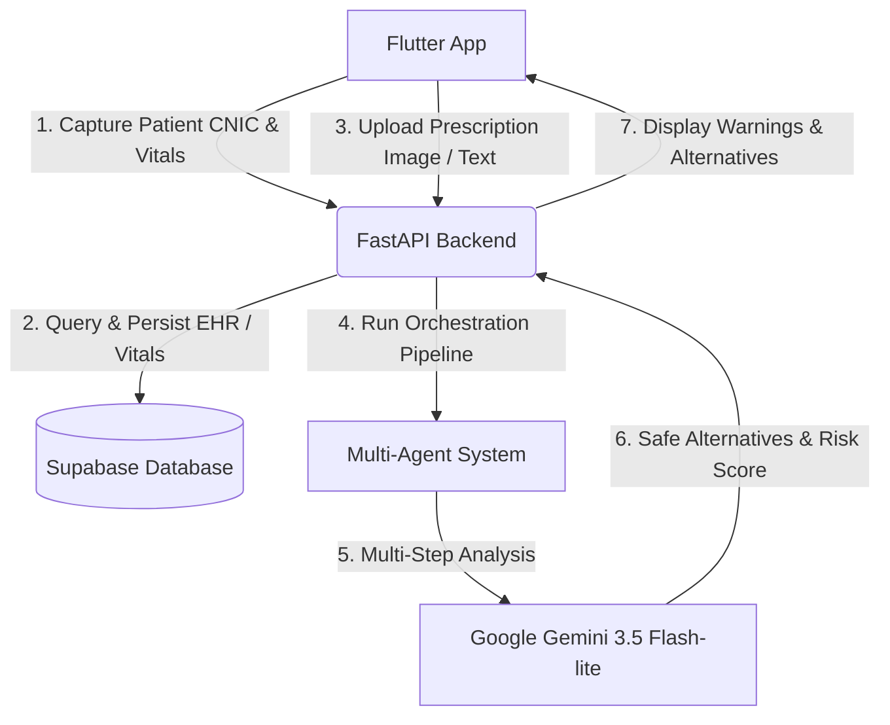

# PakDocAI: AI-Augmented Clinical Decision Support System

PakDocAI is a full-stack, AI-powered medical decision-support platform designed to reduce prescribing errors, verify drug dosages, screen for adverse drug-condition/drug-allergy interactions, and digitize prescriptions in real-time.

---

## 🛠️ System Architecture

PakDocAI follows a multi-tier, AI-augmented architecture:



1. **Frontend (Flutter)**: A cross-platform mobile interface used by clinicians to register patients, log vital signs, and scan handwritten or printed prescriptions.
2. **Backend (FastAPI)**: A Python service that orchestrates database lookups, exposes REST endpoints, and manages the multi-agent AI system.
3. **Database (Supabase)**: A relational PostgreSQL database storing patient demographics, chronic histories, allergies, and encounter-based vitals.
4. **AI Core (Gemini 2.0 Flash)**: Powered by Google GenAI SDK, providing computer vision for prescription OCR and logical reasoning across agents.

---

## 🤖 Developed Agents

Rather than relying on a single AI prompt, PakDocAI utilizes an **Autonomous Multi-Agent System** that simulates a clinical advisory board to debate patient safety:

| Agent Name | Primary Responsibility | Input Source |
| :--- | :--- | :--- |
| **Prescription Intake Agent** | Extracts medication, dosage, and frequency from text or image input. | OCR / Text |
| **Medicine Knowledge Agent** | Identifies the drug's class, standard dosage parameters, and common side effects. | Gemini LLM |
| **Drug Interaction Agent** | Evaluates potential hazards against the patient's medical history. | Patient History |
| **Patient Risk Assessment Agent** | Validates safety against current patient vitals (e.g., Blood Pressure, Heart Rate). | Vitals & Allergies |
| **Recommendation Agent** | Synthesizes all findings, assigns a final risk level, and recommends alternative treatments. | Prior Agent Steps |

---

## 🔌 API Documentation

### 1. Database Operations (Real APIs via Supabase Client)
* **Register Patient**
  * `POST /patients`
  * Registers or updates a patient profile (CNIC, name, DOB, gender, contact, allergies, history).
* **Get Patient & Latest Vitals**
  * `GET /patients/{cnic}`
  * Fetches patient demographics along with their most recent vital stats from their visit history.
* **Log Visit**
  * `POST /visits`
  * Records encounter-based vitals (weight, height, BP, heart rate, temperature, chief complaint).

### 2. Clinical AI Analysis (Real APIs via Gemini API)
* **Analyze Text Prescription**
  * `POST /analyze`
  * Accepts a textual prescription string and runs the full 5-agent safety simulation.
* **Analyze Image Prescription (OCR + VLM)**
  * `POST /analyze-image`
  * Accepts an uploaded image file (`multipart/form-data`) and uses Gemini's vision capability to parse and run the safety checks.

---

## ⚡ Integration Details

- **Vision-Language OCR**: The mobile app utilizes the device's camera to capture prescriptions. The backend uses `PIL` to read image byte data and feeds it directly into the Gemini model alongside specific prompts for structured extraction.
- **Relational Integrity**: Patient vitals are isolated in `patient_visits` linked to `patients` via the `patient_cnic` foreign key. This ensures patient records remain dynamic over time.
- **Color-Coded Safety Indicator**: The backend output maps directly to visual color cues in the Flutter app:
  - 🟢 **GREEN**: No contraindications. Safe to proceed.
  - 🟡 **YELLOW**: Minor risk / dosage warning. Monitor patient.
  - 🔴 **RED**: High risk / contraindicated. Suggests safer alternatives.

---

## 🚀 Setup & Execution

### Backend Setup
1. Navigate to the backend directory:
   ```bash
   cd backend
   ```
2. Install dependencies:
   ```bash
   pip install -r requirements.txt
   ```
3. Create a `.env` file with the following variables:
   ```env
   SUPABASE_URL="your-supabase-url"
   SUPABASE_KEY="your-supabase-service-role-key"
   GEMINI_API_KEY="your-gemini-api-key"
   MODEL_ID="gemini-2.0-flash"
   ```
4. Run the development server:
   ```bash
   python main.py
   ```

### Frontend Setup
1. Navigate to the frontend directory:
   ```bash
   cd frontend
   ```
2. Install dependencies:
   ```bash
   flutter pub get
   ```
3. Run the application:
   ```bash
   flutter run
   ```
